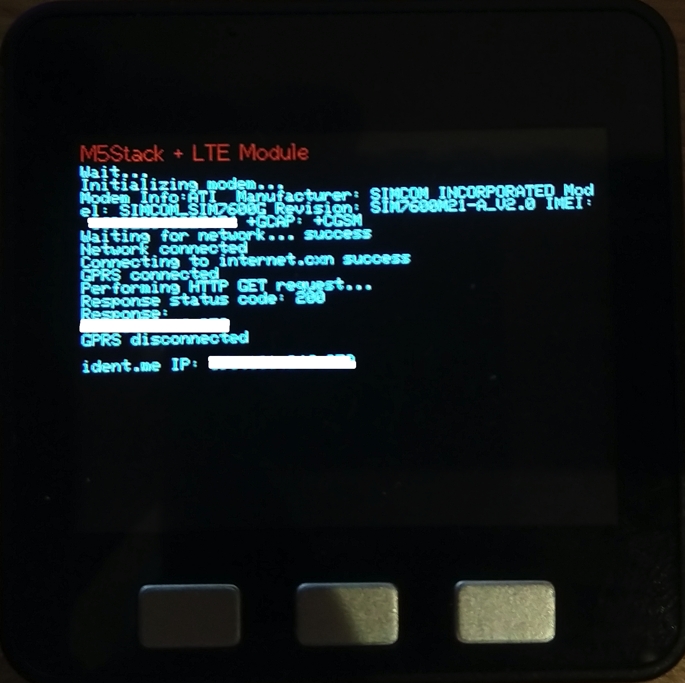

# ident.me Example

Web Client example connection to http://ident.me and retriving device public IP

## Flow

- Initialize modem
- Get modem info
- Connect to cellular network
- Connect to GPRS via APN
- Get device public IP from http://ident.me

## Serial output

```
18:09:26.363 -> Modem Info:ATI  Manufacturer: SIMCOM INCORPORATED Model: SIMCOM_SIM7600G Revision: SIM7600M21-A_V2.0 IMEI: 123456789012345 +GCAP: +CGSM
18:09:26.363 -> Waiting for network... success
18:09:26.363 -> Network connected
18:09:26.363 -> Connecting to internet.cxn success
18:09:26.506 -> GPRS connected
18:09:26.506 -> Performing HTTP GET request...
18:09:28.218 -> Response status code: 200
18:09:28.290 -> Response:
18:09:28.290 -> 93.81.26.39
18:09:28.290 -> GPRS disconnected
18:09:28.290 -> 
18:09:28.290 -> ident.me IP: 93.81.26.39
```

## Display


